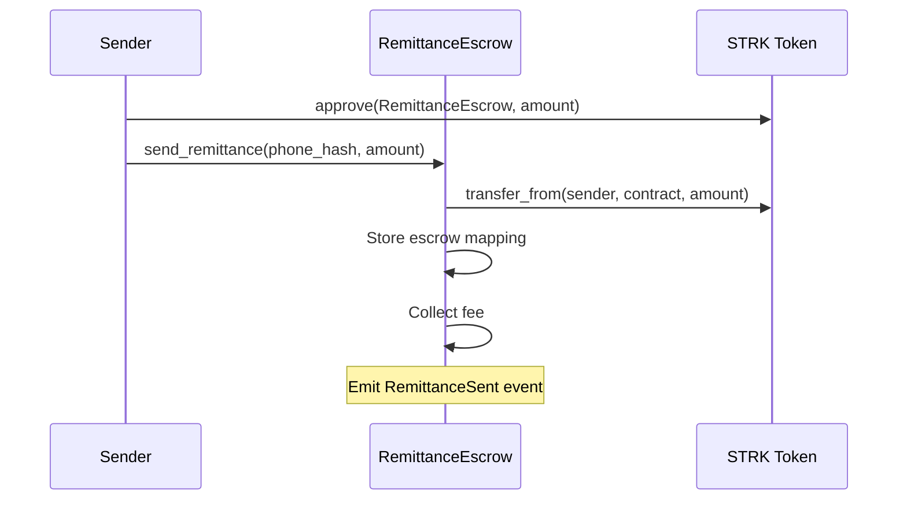
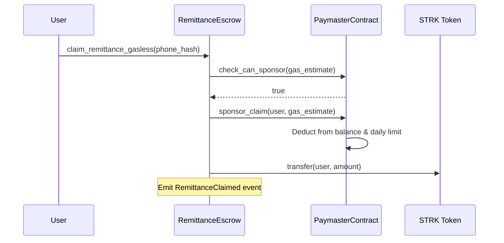
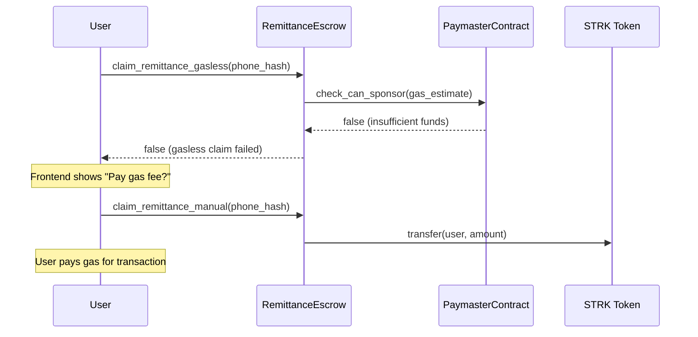
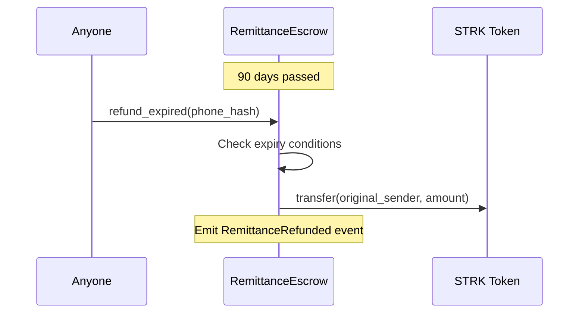

# StarkRemit Smart Contracts

StarkRemit is a cross-border remittance protocol built on Starknet that enables instant, low-cost, gasless micro-remittances ($1–$50) using phone-number-based escrow system.

##  Overview

The protocol consists of two main smart contracts that work together to provide gasless remittance claims for recipients:

- **RemittanceEscrow.cairo** - Core escrow logic for phone-number-based remittances
- **PaymasterContract.cairo** - Gas sponsorship system for gasless recipient claims

##  Architecture

```
┌─────────────────┐    ┌──────────────────┐    ┌─────────────────┐
│   Sender        │    │  RemittanceEscrow │    │  PaymasterContract │
│   (Wallet)      │───▶│   Contract       │───▶│   Contract      │
└─────────────────┘    └──────────────────┘    └─────────────────┘
         │                        │                       │
         │                        │                       │
         ▼                        ▼                       ▼
   STRK Transfer            Phone Hash Escrow        Gas Sponsorship
                               (90 days)              (Daily Limits)
```

##  Core Features

### RemittanceEscrow Contract

**Primary Functions:**
- `send_remittance(phone_hash, amount)` - Send money to a phone number hash
- `claim_remittance_gasless(phone_hash)` - Attempt gasless claim via paymaster
- `claim_remittance_manual(phone_hash)` - Fallback claim where user pays gas
- `refund_expired(phone_hash)` - Refund unclaimed funds after 90 days

**Key Features:**
-  Phone number hashing for privacy
-  Automatic fee collection ($0.01 per transfer)
-  90-day expiry with automatic refunds
-  Collision-resistant escrow mapping
-  Event emission for backend integration

### PaymasterContract

**Primary Functions:**
- `sponsor_claim(claimer, gas_estimate)` - Sponsor gas for authorized contracts
- `check_can_sponsor(gas_estimate)` - Pre-check sponsorship availability
- `fund_paymaster(amount)` - Add STRK tokens for gas sponsorship
- `set_authorized_contract(address)` - Authorize contracts to request sponsorship

**Security Features:**
-  Daily spending limits to prevent drain attacks
-  Authorized contract system
-  Emergency withdrawal for owner
-  Gas price multiplier for safety buffer (1.5x)

##  How It Works

### 1. Send Remittance Flow



### 2. Gasless Claim Flow (Success)



### 3. Manual Claim Flow (Paymaster Insufficient)



### 4. Expired Refund Flow



##  Economics

### Fee Structure
- **Transfer Fee**: $0.01 STRK per remittance
- **Gas Cost**: ~$0.003 per claim (sponsored by paymaster)
- **Net Revenue**: ~$0.007 per transfer for sustainability

### Paymaster Economics
- **Daily Limits**: Configurable spending limits (e.g., 1 ETH equivalent/day)
- **Safety Buffer**: 1.5x gas price multiplier for estimation errors
- **Self-Sustaining**: Fee collection funds ongoing gas sponsorship

##  Deployment Guide

### Prerequisites
- Starknet CLI tools installed
- Funded Starknet Sepolia testnet account
- STRK test tokens from faucet

### Step 1: Deploy PaymasterContract

```bash
starknet declare --contract target/dev/smartcontract_PaymasterContract.contract_class.json

starknet deploy --class-hash <PAYMASTER_CLASS_HASH> \
  --inputs <OWNER_ADDRESS> <STRK_TOKEN_ADDRESS> <DAILY_LIMIT>
```

**Parameters:**
- `OWNER_ADDRESS`: Your wallet address
- `STRK_TOKEN_ADDRESS`: `0x04718f5a0fc34cc1af16a1cdee98ffb20c31f5cd61d6ab07201858f4287c938d` (Sepolia)
- `DAILY_LIMIT`: `1000000000000000000` (1 ETH equivalent)

### Step 2: Deploy RemittanceEscrow

```bash
starknet declare --contract target/dev/smartcontract_RemittanceEscrow.contract_class.json

starknet deploy --class-hash <ESCROW_CLASS_HASH> \
  --inputs <OWNER_ADDRESS> <PAYMASTER_ADDRESS> <STRK_TOKEN_ADDRESS> <INITIAL_FEE>
```

**Parameters:**
- `PAYMASTER_ADDRESS`: Address from Step 1
- `INITIAL_FEE`: `10000000000000000` (0.01 STRK)

### Step 3: Configure Authorization

```bash
# Authorize RemittanceEscrow to use PaymasterContract
starknet invoke --address <PAYMASTER_ADDRESS> \
  --abi target/dev/smartcontract_PaymasterContract.abi.json \
  --function set_authorized_contract \
  --inputs <ESCROW_ADDRESS>
```

### Step 4: Fund Paymaster

```bash
# First approve STRK spending
starknet invoke --address <STRK_TOKEN_ADDRESS> \
  --function approve \
  --inputs <PAYMASTER_ADDRESS> <FUNDING_AMOUNT>

# Then fund the paymaster
starknet invoke --address <PAYMASTER_ADDRESS> \
  --function fund_paymaster \
  --inputs <FUNDING_AMOUNT>
```

##  Testing

### Test Scenario 1: Successful Gasless Claim

```bash
# 1. Send remittance
starknet invoke --address <ESCROW_ADDRESS> \
  --function send_remittance \
  --inputs <PHONE_HASH> <AMOUNT>

# 2. Attempt gasless claim
starknet invoke --address <ESCROW_ADDRESS> \
  --function claim_remittance_gasless \
  --inputs <PHONE_HASH>
```

### Test Scenario 2: Paymaster Insufficient Fallback

```bash
# 1. Drain paymaster (owner only)
starknet invoke --address <PAYMASTER_ADDRESS> \
  --function emergency_withdraw \
  --inputs <LARGE_AMOUNT>

# 2. Try gasless claim (should fail)
starknet call --address <ESCROW_ADDRESS> \
  --function claim_remittance_gasless \
  --inputs <PHONE_HASH>

# 3. Use manual claim
starknet invoke --address <ESCROW_ADDRESS> \
  --function claim_remittance_manual \
  --inputs <PHONE_HASH>
```

## Monitoring & Analytics

### Key Events to Track

**RemittanceEscrow Events:**
- `RemittanceSent` - New remittance created
- `RemittanceClaimed` - Successful claim (track gasless vs manual)
- `RemittanceRefunded` - Expired refund processed

**PaymasterContract Events:**
- `ClaimSponsored` - Successful gas sponsorship
- `SponsorshipFailed` - Failed sponsorship attempts
- `PaymasterFunded` - New funding received

### Useful Queries

```bash
# Check paymaster balance
starknet call --address <PAYMASTER_ADDRESS> \
  --function get_available_balance

# Check daily usage
starknet call --address <PAYMASTER_ADDRESS> \
  --function get_daily_usage

# Check pending remittance
starknet call --address <ESCROW_ADDRESS> \
  --function get_pending_balance \
  --inputs <PHONE_HASH>
```

## 🔒 Security Considerations

### Access Controls
- **Owner Functions**: Fee updates, paymaster funding, emergency withdrawals
- **Authorized Contracts**: Only approved contracts can request gas sponsorship
- **Daily Limits**: Prevents paymaster drain attacks

### Best Practices
1. **Monitor Paymaster Balance**: Set up alerts for low balance
2. **Adjust Daily Limits**: Based on usage patterns and security needs
3. **Regular Audits**: Review authorized contracts and spending patterns
4. **Emergency Procedures**: Know how to pause/withdraw in emergencies


